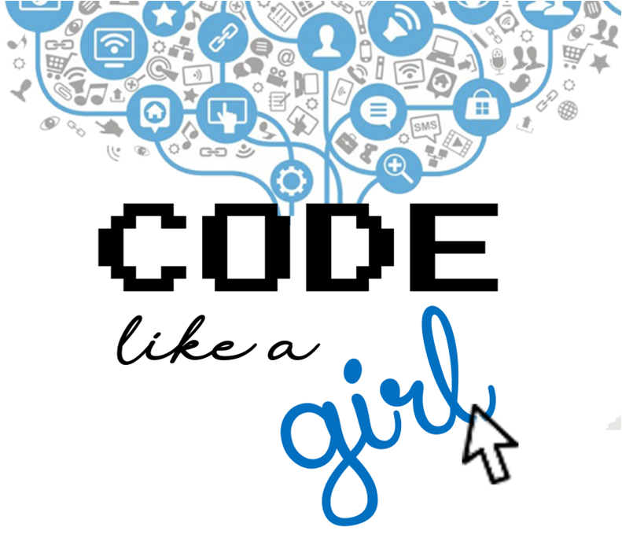

<div align="center" id="menu">



<h3> Jogo de Plataforma em Python </h3>

 <a href="https://www.python.org/" target="blank"></a> 
 <a href="https://www.pygame.org/" target="blank"></a> 

</div>

<br>

## :pencil: Sobre o projeto

O **Code like a Girl** é um jogo de plataforma desenvolvido como parte de um projeto de Engenharia do programa **Mulheres em STEM2D**, ministrado no **Instituto Tecnológico de Aeronáutica (ITA)**, pela **Divisão de Ciência da Computação - IEC**. O objetivo deste projeto é ensinar os conceitos de programação **Python** de forma prática, antes de começar o jogo, permitindo que os jogadores pratiquem e desenvolvam suas habilidades enquanto constroem o próprio jogo.

O jogo foi desenvolvido por alunas e professoras do ITA, utilizando o framework **Pygame**. A proposta é que, antes de entrar no jogo, os jogadores aprendam a programar, e então possam aplicar o que aprenderam enquanto avançam no jogo, enfrentando obstáculos e desafios práticos relacionados ao desenvolvimento do código e do jogo.

Confira o vídeo do jogo em andamento:
<div align="center">
  <video width="600" controls>
    <source src="./docs/VideoDoJogo.mp4" type="video/mp4">
    Seu navegador não suporta o elemento de vídeo.
  </video>
</div>

<br>

Apostila: [Clique para visualizar o PDF](./docs/Apostila2019.pdf)

<br>

## :scroll: Instruções

Instalar o Python

Caso ainda não tenha, faça o download da versão mais recente do Python em [python.org](https://www.python.org/downloads/).
  ```
  https://nodejs.org/pt/download/prebuilt-installer
  ```

Instalar o Pygame
  ```
  pip install pygame
  ```

 <br>

<a href="#menu">Voltar ao topo</a>
